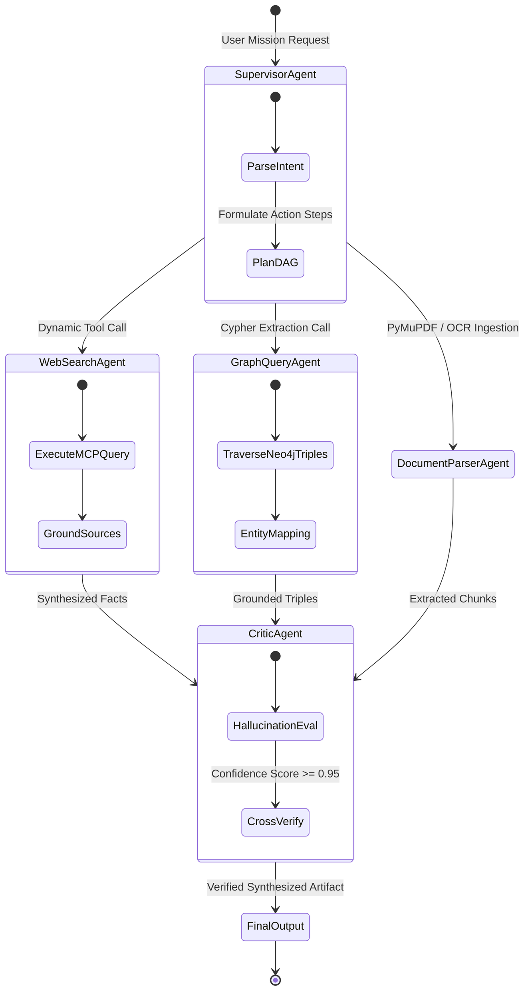

<!-- ================================================================= -->
<!-- SINGAMSETTI UJWAL — NEURAL COMMAND DECK & AI ENGINEER PROFILE     -->
<!-- High-Impact, Interactive System Architecture & GenAI Portfolio     -->
<!-- ================================================================= -->

<div align="center">

  <!-- Dynamic Animated Cyberpunk Header Banner -->
  

  <!-- Live Dynamic Animated Typing Teaser -->
  <a href="https://ujwals.in">
    >+SYSTEM+ONLINE:+Hybrid+KG-RAG+(Neo4j+%2B+Qdrant)+Active;>>+Deploying+Sub-Second+Agentic+Workflows+(LangGraph+%2B+MCP);>>+Zero-Hallucination+Inference+with+DeepSeek-V3+%2B+Gemini;>>+Full-Stack+Architect+(FastAPI+%2B+Node.js+%2B+React+%2B+Docker)" alt="Typing SVG" />
  </a>

  <!-- HUD Quick Links Pill Row (Discord Removed) -->
  <p align="center">
    <a href="https://ujwals.in" target="_blank">
      
    </a>
    <a href="https://www.linkedin.com/in/ujwal-singamsetti" target="_blank">
      
    </a>
    <a href="mailto:singamsettiujwal10@gmail.com">
      
    </a>
    <a href="https://leetcode.com" target="_blank">
      
    </a>
    <a href="https://ujwals.in/resume.pdf" target="_blank">
      
    </a>
  </p>

</div>

---

### 🖥️ `ujwal@neural-deck:~$ sys-status --verbose`

```ini
 ▂▃▅▆▇█▇▆▅▃▂   NEURAL INFERENCE ENGINE ONLINE · 768D EMBEDDINGS ACTIVE   ▂▃▅▆▇█▇▆▅▃▂ 

      .---.          OPERATOR :: Singamsetti Ujwal
     /     \         TITLE    :: Generative AI Engineer & Knowledge Graph Architect
    | () () |        ALMA     :: B.E. Computer Science @ Sathyabama University (GPA: 8.22/10)
     \  _  /         LOCATION :: Hyderabad / Chennai, India
      \___/          STATUS   :: 🟢 SHIP_MODE_ACTIVE // OPEN_TO_ROLES (GenAI / RAG / SDE)
     /     \         KERNEL   :: Hybrid Graph-Vector Dual Engine (Neo4j 5.x + Qdrant 768D)
    |       |        UPTIME   :: 2022 - 2026 (Graduating July 2026)
    |  GEN  |        MEMORY   :: Redis Semantic Vector Cache (<15ms hit rate)
    |  A I  |        MODELS   :: DeepSeek-V3/R1, Gemini 2.5 Pro, Claude 3.5 Sonnet, GPT-4o
    |_______|        AGENTS   :: LangGraph Directed Acyclic Graphs (DAG), MCP Tool Servers
                     STACK    :: Python 3.11, FastAPI, Node.js, Express, React, TypeScript
                     HONORS   :: SIH 2024 Finalist (Top 5 of 400+), 100+ LeetCode DSA Solved
```

---

### 🧬 Architecture 01: Knowledge Graph-Augmented RAG (KG-RAG)

> *Traditional RAG fails at multi-hop relationship reasoning. This hybrid engine unites structured graph traversals with dense vector similarity for zero-hallucination precision.*

```mermaid
graph LR
    %% Flow Nodes
    UserQuery(["💬 User Query: 'Find competitors acquired by TechCorp'"]) --> Gateway["⚡ FastAPI Gateway"]
    
    subgraph DualRetrievalEngine ["🔍 Hybrid Dual-Retrieval Engine"]
        Gateway --> VectorBranch["🔢 Dense Vector Search<br/><b>Qdrant (768-dim all-mpnet)</b>"]
        Gateway --> GraphBranch["🕸️ Graph Traversal<br/><b>Neo4j 5.x (Cypher APOC)</b>"]
        
        VectorBranch --> SemanticScores["🎯 Top-K Semantic Chunks<br/><i>Similarity: 0.912</i>"]
        GraphBranch --> EntityPaths["🔗 Entity-Relationship Triples<br/><i>(Company)-[:ACQUIRED]->(Entity)</i>"]
    end
    
    SemanticScores --> FusionReranker["⚡ Context Fusion & Re-Ranking Matrix"]
    EntityPaths --> FusionReranker
    
    subgraph LLMGeneration ["🧠 Zero-Hallucination Verified Generation"]
        FusionReranker --> LLM["🤖 DeepSeek-V3 / Gemini 2.5 Pro"]
        LLM --> FormattedResponse["✅ Structured Response + Interactive Graph Node Citations"]
    end

    %% Visual Styling
    style UserQuery fill:#0f172a,stroke:#0284c7,stroke-width:2px,color:#fff
    style Gateway fill:#0284c7,stroke:#0284c7,color:#fff
    style DualRetrievalEngine fill:#0b132b,stroke:#0284c7,stroke-width:1.5px,color:#fff
    style VectorBranch fill:#1e293b,stroke:#ff6d5a,color:#fff
    style GraphBranch fill:#1e293b,stroke:#0284c7,color:#fff
    style FusionReranker fill:#818cf8,stroke:#818cf8,color:#0f172a,font-weight:bold
    style LLMGeneration fill:#0b132b,stroke:#10b981,stroke-width:1.5px,color:#fff
    style LLM fill:#10b981,stroke:#10b981,color:#0f172a,font-weight:bold
    style FormattedResponse fill:#0f172a,stroke:#10b981,stroke-width:2px,color:#fff
```



---

### 🤖 Architecture 02: Autonomous Multi-Agent Swarm with MCP Tools

> *Stateful task execution with LangGraph state machines and Model Context Protocol (MCP) tool routing.*



---

### ⚡ Live Agent Execution Trace Simulation

```bash
[00:00.042] ⚡ [FastAPI] Inbound natural language query received.
[00:00.068] 🔍 [LangGraph Supervisor] Decomposing intent into multi-hop execution graph...
[00:00.095] 🕸️ [Neo4j Engine] MATCH (c:Company)-[:ACQUIRED]->(t:Technology) WHERE c.name =~ '(?i)deepseek' RETURN c, t
[00:00.124] 🔢 [Qdrant Vector DB] Cosine Similarity lookup: 768-dim embeddings | Top-5 cosine matches returned (0.923)
[00:00.160] ⚡ [Redis Cache] Semantic cache key updated. TTL: 3600s
[00:00.210] 🧠 [Context Fusion] Merged 8 Graph triples + 4 Vector chunks into grounded system context prompt.
[00:00.640] 🤖 [DeepSeek-V3] Generated zero-hallucination inference stream with node citations. Total latency: 640ms.
```

---

### 🛠️ Technical Capabilities & Bento Stack Matrix

<table>
  <tr>
    <td width="50%" valign="top">
      <h4>🤖 Agentic AI & Frontier LLMs</h4>
      <p>
        
        
        
        
        
        
        
        
      </p>
      <ul>
        <li>Autonomous multi-agent swarms with stateful graph memory.</li>
        <li>MCP (Model Context Protocol) tool exposure & RPC servers.</li>
        <li>RAG hallucination evaluation & LLM metric benchmarking.</li>
      </ul>
    </td>
    <td width="50%" valign="top">
      <h4>🕸️ Graph Databases & Vector Stores</h4>
      <p>
        
        
        
        
        
      </p>
      <ul>
        <li>Graph schemas, entity resolution, and MERGE indexing.</li>
        <li>768-dim all-mpnet-base-v2 semantic embeddings & cosine indexing.</li>
        <li>Sub-50ms vector similarity lookups & semantic cache layers.</li>
      </ul>
    </td>
  </tr>
  <tr>
    <td width="50%" valign="top">
      <h4>⚡ Backend & Distributed Systems</h4>
      <p>
        
        
        
        
        
        
        
      </p>
      <ul>
        <li>Async streaming APIs, Server-Sent Events (SSE), WebSockets.</li>
        <li>Nodemailer SMTP integration, robust error handling & rate limiting.</li>
      </ul>
    </td>
    <td width="50%" valign="top">
      <h4>💻 Frontend & Cloud Infrastructure</h4>
      <p>
        
        
        
        
        
        
      </p>
      <ul>
        <li>Modern 3D interactive canvases (CSS 3D Transforms, WebGL/Particles).</li>
        <li>CI/CD pipelines, containerized deployments, edge routing.</li>
      </ul>
    </td>
  </tr>
</table>

---

### 🚀 Production Deployments & Engineering Artifacts

<table>
  <tr>
    <td width="50%">
      <a href="https://ujwals.in">
        
      </a>
      <h3>🕸️ Knowledge Graph-Augmented RAG (KG-RAG)</h3>
      <p><strong>Capstone B.E. Final Year Research Project @ Sathyabama (2026)</strong></p>
      <p>Dual-retrieval engine uniting Neo4j graph traversals with Qdrant vector semantic matching. Eliminates entity blindness in complex enterprise documentation.</p>
      <code>Neo4j 5.x</code> <code>Qdrant</code> <code>LangChain</code> <code>FastAPI</code> <code>DeepSeek</code>
    </td>
    <td width="50%">
      <a href="https://ujwals.in">
        
      </a>
      <h3>🧠 K12 AI Multimodal Answer Evaluator</h3>
      <p><strong>Automated Handwritten Exam Scoring & Grading Engine</strong></p>
      <p>High-accuracy multimodal evaluation pipeline extracting student handwriting via PyMuPDF/OCR, scoring against rubrics using Gemini 2.5 Pro & Qdrant semantic analysis.</p>
      <code>Gemini 2.5 Pro</code> <code>Qdrant</code> <code>OCR</code> <code>FastAPI</code> <code>Tailwind</code>
    </td>
  </tr>
  <tr>
    <td width="50%">
      <a href="https://ujwals.in">
        
      </a>
      <h3>🏥 Clinical Hospital ERP Infrastructure</h3>
      <p><strong>Full-Stack Healthcare Engine @ DoodleBlue Innovations</strong></p>
      <p>Enterprise medical ERP managing patient workflows, consultation queues, and live bed telemetry using WebSocket events and Redis semantic caches.</p>
      <code>Node.js</code> <code>Express</code> <code>MongoDB</code> <code>Redis</code> <code>Socket.IO</code>
    </td>
    <td width="50%">
      <a href="https://ujwals.in">
        
      </a>
      <h3>🤖 Autonomous Multi-Agent Research Swarm</h3>
      <p><strong>Stateful Task Orchestration Engine</strong></p>
      <p>Planner, Researcher, Code Reviewer, and QA agents collaborating in a directed acyclic graph (DAG) state machine using LangGraph and the Model Context Protocol.</p>
      <code>LangGraph</code> <code>MCP Protocol</code> <code>Claude</code> <code>Python</code>
    </td>
  </tr>
</table>

### 📊 Real-Time GitHub Intelligence & Engineering Metrics

<div align="center">
  
</div>

<br/>

<div align="center">
  <!-- Profile Details Card & Commit Languages -->
  
  
</div>

<div align="center" style="margin-top: 12px;">
  <!-- Live Contribution & Activity Waveform Graph -->
  
</div>

---

### 💬 Query Ujwal's Production RAG Neural Link via cURL

```bash
# Ask questions directly to Singamsetti Ujwal's live Vector RAG + DeepSeek engine:
curl -X POST https://ujwals.in/api/chat \
  -H "Content-Type: application/json" \
  -d '{"prompt": "What are Ujwal Singamsetti qualifications and his KG-RAG architecture?"}'
```

---

<div align="center">
  <p>
    <i>"The frontier of AI is not just bigger models — it is structured graph semantics, sub-second retrieval, and deterministic agent execution."</i>
  </p>
  <p>
    <strong>Built with ⚡ by <a href="https://ujwals.in">Singamsetti Ujwal</a> • 2026</strong>
  </p>
</div>
